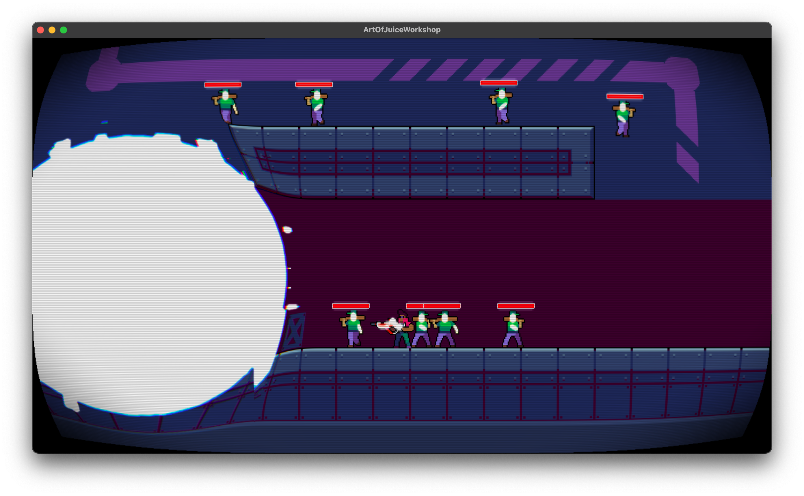

# The Art of Juice - Spillutviklingsworkshop i Kotlin med LibGDX



En introduksjon til spillutvikling med Kotlin og LibGDX, med fokus på "juice" - det som gjør spill gøye å spille!

Basert på talkene:
>_"The art of screenshake"_ - Jan Willem Nijman ("Vlambeer")
>https://www.youtube.com/watch?v=AJdEqssNZ-U

>_"Juice it or lose it"_ - Martin Jonasson ("grapefrukt")  
>https://www.youtube.com/watch?v=Fy0aCDmgnxg

En ekstra ressurs som jeg anbefaler på det aller varmeste:
>_"Game Programming Patterns"_ (bok) av Robert Nystrom.  
>Den er tilgjengelig gratis, i sin helhet, på [forfatterens egen hjemmeside](https://gameprogrammingpatterns.com/contents.html)

## Test ut spillet

For å teste ut spillet, gjør en av følgende:
* Finn profilen `Lwjgl3Launcher` øverst til høyre i IntelliJ
* Gå til fila [`Lwjgl3Launcher.kt`](lwjgl3/src/main/kotlin/dev/bakke/artofjuice/lwjgl3/Lwjgl3Launcher.kt) og kjør main-metoden der (IntelliJ bør gi deg en grønn pil)
* Kjør `./gradlew lwjgl3:run` i terminalen.

Prøv ut spillet! Keybinds:

| Tast           | Funksjon               | Info                         |
|----------------|------------------------|------------------------------|
| \[←\] \[→\]    | Bevege deg             |                              |
| \[LEFT SHIFT\] | Skyte                  | Hold inne                    |
| \[TAB\]        | Bytte våpen            |                              |
| \[SPACE\]      | Hoppe                  | Hold inne for å hoppe høyere |
| \[C\]          | Kaste granat           |                              |
| \[F1\]         | Toggle debug rendering | Huskes mellom launcher       |

>💡 **Hint: klikkbare lenker i README**  
> Hvis du åpner denne fila i IntelliJ etter å ha klonet prosjektet, kan du få opp en preview-visning. Hver gang et fil- eller mappenavn nevnes, er det en klikkbar lenke som tar deg dit.
> Hvis du er i edit mode, kan du holde inne `⌘` (eller `CTRL` på Windows) og klikke på lenken for å åpne fila i en ny fane.  
> Prøv f.eks. å gå til [Enemy.kt](core/src/main/kotlin/dev/bakke/artofjuice/enemy/Enemy.kt)

## Lett oppvarming: parameterjustering

Spillet er konfigurert med masse forskjellige parametere.

I fila [Enemy.kt](core/src/main/kotlin/dev/bakke/artofjuice/enemy/Enemy.kt) ser du hvordan fiendene "spawnes".
Prøv å justere på fiendenes hastighet, max helse, eller tyngdeakslerasjon! Kanskje verdiene kunne vært tilfeldige?

Fila [PlayerInputComponent.kt](core/src/main/kotlin/dev/bakke/artofjuice/player/PlayerInputComponent.kt) inneholder mesteparten av spillerens bevegelse-logikk.
Det er mye rart der, inkludert konstanter som styrer spillerens hastighet og hopp!

Fila [GunStats.kt](core/src/main/kotlin/dev/bakke/artofjuice/gun/GunStats.kt) styrer parameterne for våpnene til spilleren.
Tukle litt med verdiene! Hvis du vil legge til et nytt våpen, ta en titt i [GunInventoryComponent.kt](core/src/main/kotlin/dev/bakke/artofjuice/player/GunInventoryComponent.kt)

Fila [GrenadeThrowerComponent.kt](core/src/main/kotlin/dev/bakke/artofjuice/player/GrenadeThrowerComponent.kt) holder paremetrene for granaten.

> 📈 **Akser og enheter**  
>Positiv x-akse er mot høyre, og positiv y-akse er oppover.  
>Spillet er satt opp slik at det er 1 "enhet" = 1 pixel.
>Når f.eks. fiender har en "speed" på 100, så betyr det at de beveger seg 100 enheter = 100 pixels i sekundet.

## Oppgaver

### Oppgave 1: Skade-animasjon på fiende

Spillet funker, men fiendene er litt kjedelige - de reagerer jo ikke når du treffer de!  
Vi kan fikse dette ved å legge til en animasjon når fienden tar skade.

I fila [EnemyAIComponent.kt](core/src/main/kotlin/dev/bakke/artofjuice/enemy/EnemyAIComponent.kt) finner du en tom funksjon `onHit()`.

<details>
<summary>Løsningsforslag</summary>

```kotlin
private fun onHit(damage: Int) {
    animatedSprite.requestTransition(EnemyAnimatedSprite.State.HURT)
}
```
</details>

### Oppgave 2: Mer skade-reaksjon!

Det var bedre!
Men vi tåler enda litt mer reaksjon, synes jeg. Hva hvis fienden ble dyttet litt tilbake når den ble truffet?

I fila [BulletComponent.kt](core/src/main/kotlin/dev/bakke/artofjuice/gun/BulletComponent.kt) finner funksjonen `onEnemyHit(enemy: Entity)`.
* Få tak i fiendens `PhysicsComponent`
* Kall `applyImpulse()` på den, med en vektor som er langs kulas bevegelsesretning - `entity.velocity`
* For litt mer juice: vinkle impulsen litt oppover!

<details>
<summary>Løsningsforslag</summary>

```kotlin
private fun onEnemyHit(enemy: Entity) {
    ...
    val direction = entity.velocity.cpy()
    // eller, for å vinkle litt opp:
    // val direction = Vector2(entity.velocity.x, entity.velocity.x * 0.2f)
    val physicsComponent = enemy.getComponent<PhysicsComponent>()
    physicsComponent.applyImpulse(direction, force = 100f)
    ...
}
```
</details>

### Oppgave 2B: Knockback per våpen
Du fant kanskje en impulse-styrke som passet bra for ett av våpnene, men synes du det passet for alle?
Sniperrifla skyter jo sjeldnere, og gjør mer skade per skudd - kanskje den burde ha mer knockback?

* I [GunStats.kt](core/src/main/kotlin/dev/bakke/artofjuice/gun/GunStats.kt), legg til en ny parameter som bestemmer hvor mye knockback det skal være på hvert våpen.
* I hver av de definerte gunstatsene - `PISTOL`, `RIFLE`, `SNIPER` - velg en passende verdi
* Der du løste oppgave 2, bytt ut den hardkodede verdien med den nye parameteren fra `gunStats`

<details>
<summary>Løsningsforslag</summary>

```kotlin
// GunStats.kt
data class GunStats(
    ...
    val knockbackForce: Float,
) {
    companion object {
        val PISTOL = GunStats(
            ...
            knockbackForce = 100f,
        )
        val RIFLE = GunStats(
            ...
            knockbackForce = 150f,
        )
        val SNIPER = GunStats(
            ...
            knockbackForce = 800f,
        )
    }
}
```

```kotlin
// BulletComponent.kt
private fun onEnemyHit(enemy: Entity) {
    ...
    physicsComponent.applyImpulse(direction, force = gunStats.knockbackForce)
    ...
}
```
</details>

### Oppgave 3: Screenshake

Workshopen er jo oppkalt etter talken "The Art of Screenshake" - så det var vel på tide å få til litt screenshake?
Screenshake løses av et globalt "system" som rister på kameraet. Det har en intern tilstand som bestemmer hvor mye shake det er, som har en verdi mellom 0 og 1.
For å se litt hvordan det er implementert, ta en titt i [ScreenShakeSystem.kt](core/src/main/kotlin/dev/bakke/artofjuice/ScreenshakeSystem.kt). Der er det også noen parametere du kan justere på!

Vi kan ta det i bruk - legg til litt screenshake når spilleren skyter.
Få tak i `ScreenShakeSystem`-instansen i `GunComponent.kt`, og kall enten `addScreenShake()` eller `setMinimumShake()` hver gang det skytes.

<details>
<summary>Løsningsforslag</summary>

```kotlin
// GunComponent.kt
...
private val screenShakeSystem: ScreenShakeSystem by getSystemLazy()
...
fun shoot(direction: Vector2) {
    ...
    // alternativt kan man hente screenshakeSystem her
    val screenShakeSystem = getSystem<PhysicsComponent>()
    // men lazy-varianten er litt mer effektiv
    screenShakeSystem.addScreenShake(0.1f)
    // eller
    screenShakeSystem.setMinimumShake(0.1f)
    ...
}
```
</details>

### Oppgave 3B: Screenshake per våpen

Samme deal som 2B - valg av våpen føles mer betydningsfullt hvis de oppfører seg forskjellig.
Da kan de gjerne ha forskjellig mengde screenshake også!

<details>
<summary>Hint 💡</summary>

* Legg på en ny parameter i `GunStats.kt` som bestemmer hvor mye screenshake det skal være
* Oppdater `PISTOL`, `RIFLE` og `SNIPER` med passende verdier
* Bytt ut den hardkodede verdien i `GunComponent.kt` med den nye parameteren
</details>

<details>
<summary>Løsningsforslag</summary>

```kotlin
// GunStats.kt
data class GunStats(
    ...
    val screenshakeAmount: Float,
) {
    companion object {
        val PISTOL = GunStats(
            ...
            screenshakeAmount = 0.3f,
        )
        val RIFLE = GunStats(
            ...
            screenshakeAmount = 0.45f,
        )
        val SNIPER = GunStats(
            ...
            screenshakeAmount = 0.6f,
        )
    }
}
```

```kotlin
// GunComponent.kt
fun shoot(direction: Vector2) {
    ...
    screenShakeSystem.setMinimumShake(gun.stats.screenshakeAmount)
    ...
}
```
</details>

### Oppgave 3C: Screenshake på granat
Granaten er jo også et våpen, og den kan også lage litt screenshake når den eksploderer!

Legg til litt screenshake når den eksploderer - titt i [ExplosionComponent.kt](core/src/main/kotlin/dev/bakke/artofjuice/player/ExplosionComponent.kt)

<details>
<summary>Løsningsforslag</summary>

```kotlin
private fun explode() {
    ...
    getSystem<ScreenShakeSystem>().addScreenShake(0.5f)
}
```
</details>

### Oppgave 4: Knockback på spilleren

I oppgave 2 fikk vi til knockback på fienden nå de ble truffet - for å gi våpenet enda mer futt, kanskje det skal dytte spilleren tilbake hver gang det skytes?  
Gjør endringen i [GunComponent.kt](core/src/main/kotlin/dev/bakke/artofjuice/gun/GunComponent.kt) - legg på impuls på spilleren i hver gang det skytes.

<details>
<summary>Hint 💡</summary>

* Endringen gjøres i `shoot()`-metoden
* Få tak i spillerens `PhysicsComponent` enten i metoden, eller utenfor - da må den være "lazy"
* Knockback-retning bør være motsatt av retningen det skytes i
* Impulsen kan være konstant, eller det avhengig av våpenets stats, hvis du gjorde oppgave 2B
</details>

<details>
<summary>Løsningsforslag</summary>

```kotlin
// GunComponent.kt
private val physicsComponent: PhysicsComponent by getComponentLazy()
...
fun shoot(direction: Vector2) {
    ...
    // alternativt kan man hente physicsComponent her
    val physicsComponent = getComponent<PhysicsComponent>()
    // men lazy-varianten er litt mer effektiv
    val knockbackDirection = -direction
    physicsComponent.applyImpulse(knockbackDirection, force = 100f) // eller gunStats.knockbackForce
    ...
}
```
</details>


### Oppgave 5: Kamerabevegelse

⚠️**Matte-advarsel** ⚠️ -️ dette handler nesten utelukkende om vektormatte. Hvis du synes matte er kjipt, gå rett til løsningsforslag!

Kamerabevegelse er nesten litt usynlig - du merker det sjeldent bevisst, men den har mye å si for følelsen av et spill!  
Den nåværende kamerabevegelsen er satt opp i [CameraComponent.kt](core/src/main/kotlin/dev/bakke/artofjuice/CameraComponent.kt), og oppdaterer kameraet til å være en bestemt avstand over spilleren, hver eneste frame.

Det er mye man kan gjøre med kamerabevegelse. 

<details>
<summary>Ting du kan prøve ut</summary>

### Asymptotic averaging
For å smoothe den ut, kan man bruke "asymptotic averaging", et skummelt begrep for en overraskende enkel formel:
```raw
cameraPosition += (targetPosition - cameraPosition) * 0.1
```
Altså, for hvert steg (hver frame), legger man til en liten del (10%) av forskjellen mellom den nåværende posisjonen og målet.
Her kan man justere på verdien - jo høyere tallet er, jo raskere vil kameraet bevege seg mot målet. Hvis verdien er 1, så vil kameraet alltid være på målet. Hvis verdien er 0, så vil kameraet aldri bevege seg.  
Merk at dette er framerate-avhengig, siden vi ikke har ganget inn delta time. Det kan man gjøre, men da bør koeffisienten økes - den enkleste måten å finne gode verdier, er ved å eksperimentere!

En enkel utvidelse er å ha to forskjellige hastigheter for x- og y-aksene. Da kan man f.eks. ha en mer "snappy" bevegelse på y, og en mer "smooth" bevegelse på x.  
Så kan man gå mer avansert: kanskje det skal være forskjell på når spilleren beveger seg oppover og nedover?

### Dead zones og lookahead
Man kan også ha _dead zones_ - at spilleren må ha beveget seg en viss avstand fra kameraets nåværende posisjon for at kamera skal gidde å flytte på seg.

Litt motsatt _dead zones_ er _lookahead_ - at kameraet ligger "foran" spilleren, slik at når spilleren snur seg mot høyre, ser man mer av høyresiden - og omvendt. 
I et spill med hopping, er det også lurt å f.eks. ha _lookahead_ nedover når man faller, så man kan se hvor man skal lande.
</details>

**Prøv ut litt forskjellig, se hva som føles bra!**

<details>
<summary>Løsningsforslag</summary>

Et kamera kan justeres inn i evigheten - mitt eget svar på "godt nok" ligger i [SondresCameraComponent.kt](core/src/main/kotlin/dev/bakke/artofjuice/SondresCameraComponent.kt).
Kopier koden inn i `CameraComponent`, eller bytt ut hvilken komponent som brukes i [GameScreen.kt](core/src/main/kotlin/dev/bakke/artofjuice/screens/GameScreen.kt) med den.
</details>

### Oppgave 6: En betydningsfull død

Det er litt trist hvordan fiendene bare forsvinner når de dør.
Hva hvis vi fikk en liten animasjon på det - og så ble de liggende?

Her er det flere problemer vi skal løse.
Når fienden dør, så bør den:
* Ikke umiddelbart fjernes
* Starte en animasjon
* Ikke ha noe "oppførsel" lenger
* Ikke bevege seg
* Ikke bli truffet av kuler
* Ikke ha en health bar - hvert fall ikke etter at den har animert ned til null helse

⚠️ **Denne er litt ekstra knotete**, det er ganske mange ting du bare må vite hvordan gjøres.  
Ha lav terskel for å spørre om hjelp eller sjekke ut løsningsforslaget her!

<details>
<summary>Løsningsforslag</summary>

Koden er allerede skrevet, og ligger i fila [EnemyDeathComponent.kt](core/src/main/kotlin/dev/bakke/artofjuice/enemy/EnemyDeathComponent.kt).  
Du kan enten copy/paste den inn i `onDeath()` i `EnemyAIComponent.kt`, eller så kan du bruke den ferdigskrevne komponenten:

I [EnemyAIComponent.kt](core/src/main/kotlin/dev/bakke/artofjuice/enemy/EnemyAIComponent.kt), fjern `onDeath()`-metoden, og linja i `lateInit()` som legger den til.

I [Enemy.kt](core/src/main/kotlin/dev/bakke/artofjuice/enemy/Enemy.kt), legg til den den ferdigskrevene komponenten.
```kotlin
fun World.spawnEnemy(position: Vector2, direction: Float) {
    spawnEntity(position) {
        ...
        +EnemyDeathComponent()
        ...
    }
}
```

</details>

### Oppgave 6B: En morsom død

Okei, så nå ligger fiendene bare der, og ser triste ut. Hva hadde gjort dette bedre?
Helt riktig, 💥**EKSPLOSJONER**💥. Kanskje som en tilfeldig sjanse?

Når fienden dør, ha en sjanse til å eksplodere - spawn en ny entity med `spawnEntity`. Gi den kun en `ExplosionComponent`.

<details>
<summary>Løsningsforslag</summary>

Gjøres hvor enn `onDeath()`-metoden din er - enten i [EnemyAIComponent.kt](core/src/main/kotlin/dev/bakke/artofjuice/enemy/EnemyAIComponent.kt), eller i [EnemyDeathComponent.kt](core/src/main/kotlin/dev/bakke/artofjuice/enemy/EnemyDeathComponent.kt)
```kotlin
private fun onDeath() {
    ...
    if (Math.random() < 0.3f) {
        spawnEntity(entity.position.cpy()) {
            +ExplosionComponent(explosionRadius =  50f, damage = 40, knockbackIntensity = 1000f)
        }
    }
}
```

</details>

### Oppgave 7: Post-processing shaders

LibGDX har støtte for shaders! Jeg har laget en enkel post-processing pipeline, som vi nå kan teste ut.  

I [GameScreen.kt](core/src/main/kotlin/dev/bakke/artofjuice/screens/GameScreen.kt), finn oppsettet av `RenderPipeline`.
Jeg har kommentert ut pipeline-stegene - kommenter de inn igjen, og se hva som skjer! 🎆

Se om du kan lage din egen shader, ved å herme etter et av de eksisterende `ShaderPass`-ene.
Shaders legger du i mappa [assets/shaders](assets/shaders).

Hvis du har behov for å sette uniforms før hver frame, så kan du arve av `ShaderPass` - sjekk ut [GaussianPass.kt](core/src/main/kotlin/dev/bakke/artofjuice/rendering/GaussianPass.kt) for et eksempel!


### Oppgave 8 - ∞: Frilek

Det er i dine hender nå, finn på noe gøy!

Kanskje spilleren burde ha helse, og kunne ta skade?  
Kanskje burde man ha en UI som viser score, som går opp for hver fiende man dreper?  
Kanskje spilleren burde få XP, gå opp i level og gjøre mer skade?  
Hva hvis fiendene kunne skyte tilbake?  
Hvorfor ikke lage en boss?

...

Jeg har hørt rykter om at noen andre spill inneholder lyd?

## Jeg vil endre på "mappet"!

Synd 🤡🤠

Mappet er laget med den gratis programvaren [Tiled Map Editor](https://www.mapeditor.org/).

Oppsettet jeg har gått for er litt kronglete. Jeg vil **ikke** anbefale å prøve å få til noe særlig her i løpet av workshopen.
Hvis du likevel ønsker å gjøre endringer, for eksempel hvis du er Sondre og lurer på hvordan i all verden det var satt opp igjen, les videre.

Selve tilemappet ligger i fila [map.tmx](assets/map.tmx) i assets - åpne den for å redigere.  
Det er satt opp "automapping" i Tiled - i laget `proto`, tegn med den nesten helt mørke tilen (`ID: 1`) for å få til automapping, som dukker opp i laget `metal`.  

Kollisjon bestemmes av rectangle-objektene i laget `metal_collision`.  
Hvis du er Sondre, så har du satt opp en plugin som lager dette for deg - marker laget "metal" og trykk `⌘K`, eller gå til `Edit > My Custom Action`.
Hvis du ikke er Sondre, eller hvis du har mistet pluginen, så må du tegne kollisjonsrektanglene selv. Mas på Sondre for å få tak i pluginen.

Objektene i laget `Player` bestemmer hvor spiller spawner (`Player`), og hvor enemy-spawneren er (`Enemy`).

## Assets

Spillet er laget med gratis (krever innlogging) assets fra [craftpix.net](https://craftpix.net/).

Hele eller deler av følgende assets er brukt i spillet:

https://craftpix.net/freebies/free-industrial-zone-tileset-pixel-art/

https://craftpix.net/freebies/free-3-cyberpunk-characters-pixel-art/

https://craftpix.net/freebies/free-city-enemies-pixel-art-sprite-sheets/

https://craftpix.net/freebies/free-guns-for-cyberpunk-characters-pixel-art/

https://craftpix.net/freebies/free-guns-pack-2-for-main-characters-pixel-art/
